<div align="center">

# 📚 SAP RAP Book Management

**Enterprise-Grade Book Management Application Built with ABAP Cloud & RAP**

[](https://www.sap.com/products/technology-platform.html)
[](https://community.sap.com/topics/abap)
[](https://community.sap.com/topics/abap/rap)
[](https://www.odata.org/)
[](https://experience.sap.com/fiori-design-web/)
[]()

---

A full-stack SAP application demonstrating the **ABAP RESTful Application Programming Model (RAP)** with managed business object behavior, draft processing, backend validations, determinations, bound actions, CDS-driven data modeling, and a metadata-driven SAP Fiori Elements UI — all built on **ABAP Cloud** following **Clean Core** principles.

</div>

---

## 📋 Table of Contents

- [Project at a Glance](#-project-at-a-glance)
- [Business Problem](#-business-problem)
- [Business Requirements](#-business-requirements)
- [UX / UI Goal](#-ux--ui-goal)
- [Solution Architecture](#-solution-architecture)
- [End-to-End Business Flow](#-end-to-end-business-flow)
- [RAP Business Object Architecture](#-rap-business-object-architecture)
- [Data Model](#-data-model)
- [Features Implemented](#-features-implemented)
  - [Automatic Book ID](#-automatic-book-id-generation)
  - [RAP Validation](#-rap-validation--validatetitle)
  - [RAP Determination](#-rap-determination--calculateyearssincepublished)
  - [Discounted Price](#-discounted-price-calculation)
  - [Genre Value Help](#-genre-value-help)
  - [Rating UX](#-rating-ux)
  - [Recommendation Action](#-recommendation-action--getrecommendations)
- [AI-Assisted Development](#-ai-assisted-development)
- [UI / UX Architecture](#-ui--ux-architecture)
- [UI Information Architecture](#-ui-information-architecture)
- [Draft Architecture](#-draft-architecture)
- [Backend-Controlled Fields](#-backend-controlled-fields)
- [Testing & Development Challenges](#-testing--development-challenges)
- [Key Technical Learnings](#-key-technical-learnings)
- [Development Journey](#-development-journey)
- [Screenshots](#-screenshots)
- [Feature Matrix](#-feature-matrix)
- [Business Value](#-business-value)
- [Why This Project Matters to Recruiters](#-why-this-project-matters-to-recruiters)
- [Future Enhancements](#-future-enhancements)
- [Repository Structure](#-repository-structure)
- [Developer](#-developer)
- [Portfolio Disclaimer](#-portfolio-disclaimer)

---

## 🔍 Project at a Glance

| Dimension | Detail |
|---|---|
| **Application** | Book Management (Create, Update, Delete, Search, Filter) |
| **Architecture** | ABAP RESTful Application Programming Model (Managed RAP) |
| **Backend** | ABAP Cloud, CDS View Entities, Behavior Definitions & Pools |
| **Frontend** | SAP Fiori Elements — List Report + Object Page |
| **Protocol** | OData V4 |
| **Draft** | Full draft-enabled transactional processing |
| **Validations** | RAP backend validation (`validateTitle`) |
| **Determinations** | Automatic field calculations (`calculateYearsSincePublished`) |
| **Actions** | Bound RAP action (`getRecommendations`) |
| **Value Help** | CDS-driven genre dropdown (`ZC_GENRE_VH`) |
| **AI in Development** | SAP Joule / predictive code completion during development |
| **Package** | `ZAC_GE362159` |

---

## 💼 Business Problem

Managing book data in an enterprise context often suffers from:

- **Manual data entry errors** — IDs typed by hand lead to duplicates and conflicts
- **Inconsistent classification** — free-text genre fields produce dirty data
- **Missing calculations** — business-critical derived values (discounted prices, publication age) calculated ad-hoc or not at all
- **No validation at the source** — errors caught only downstream, increasing rework
- **Technical noise** — UUIDs, internal keys, and system fields clutter the business user's screen
- **Scattered information** — author, inventory, and recommendation data spread across disconnected views

This project solves these problems by centralizing business logic in a **RAP-managed backend** and exposing a **clean, metadata-driven Fiori Elements UI** that business users can work with confidently.

---

## 📝 Business Requirements

| ID | Requirement | Implementation Approach |
|---|---|---|
| **BR-01** | Users can **create, update, and delete** books | Managed RAP with full CRUD via Fiori Elements |
| **BR-02** | **Book ID must be auto-generated** (e.g., `BOOK0001`, `BOOK0002`) — visible, read-only, not manually entered | RAP early numbering / determination with sequential ID logic |
| **BR-03** | **Title is mandatory** and validated before save | RAP validation `validateTitle` on save |
| **BR-04** | **Years Since Published** calculated automatically from Published Date | RAP determination `calculateYearsSincePublished` |
| **BR-05** | **Discounted Price** calculated automatically (`Price × 98 / 100`) — read-only | Backend calculation with persistence mapping |
| **BR-06** | **Genre** selected through controlled value help / dropdown | CDS value help `ZC_GENRE_VH` sourced from `ZGENRE` |
| **BR-07** | **Rating** presented in a business-friendly way | Metadata-driven rating visualization |
| **BR-08** | User can execute **Get Recommendations** action | Bound RAP action `getRecommendations` |
| **BR-09** | Application supports **draft processing** | Managed RAP with draft table `ZBOOK012_D` |
| **BR-10** | **Technical fields (UUID)** hidden from business users | Metadata extension annotations |

> **Example — Discounted Price Calculation (BR-05):**
>
> | Field | Value |
> |---|---|
> | Price | 45.00 |
> | Discount Rate | 2% |
> | **Discounted Price** | **44.10** |

---

## 🎨 UX / UI Goal

Design a **business-first interface** where:

1. **Business users see only what they need** — technical keys (UUID) are hidden; generated fields (Book ID, Discounted Price) are read-only
2. **Data quality is enforced at entry** — mandatory title validation, controlled genre selection, automatic calculations
3. **Information is logically grouped** — Book overview, recommendations, author details, and inventory on separate Object Page facets
4. **Enterprise patterns are followed** — SAP Fiori Design Guidelines, List Report for search/filter, Object Page for detail

---

## 🏗 Solution Architecture

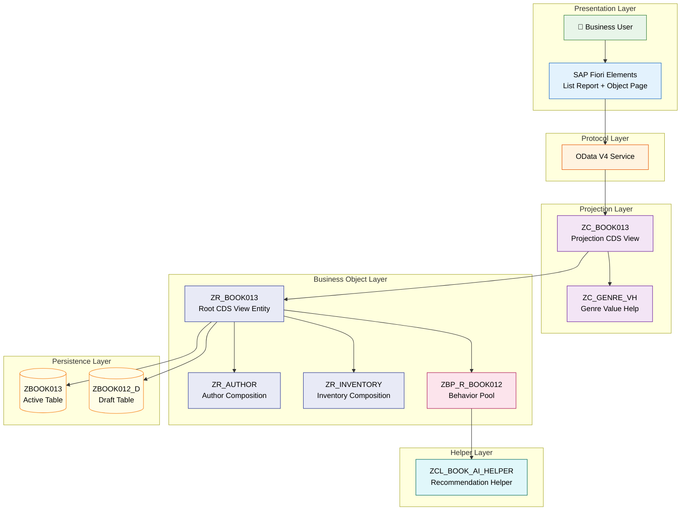

---

## 🔄 End-to-End Business Flow

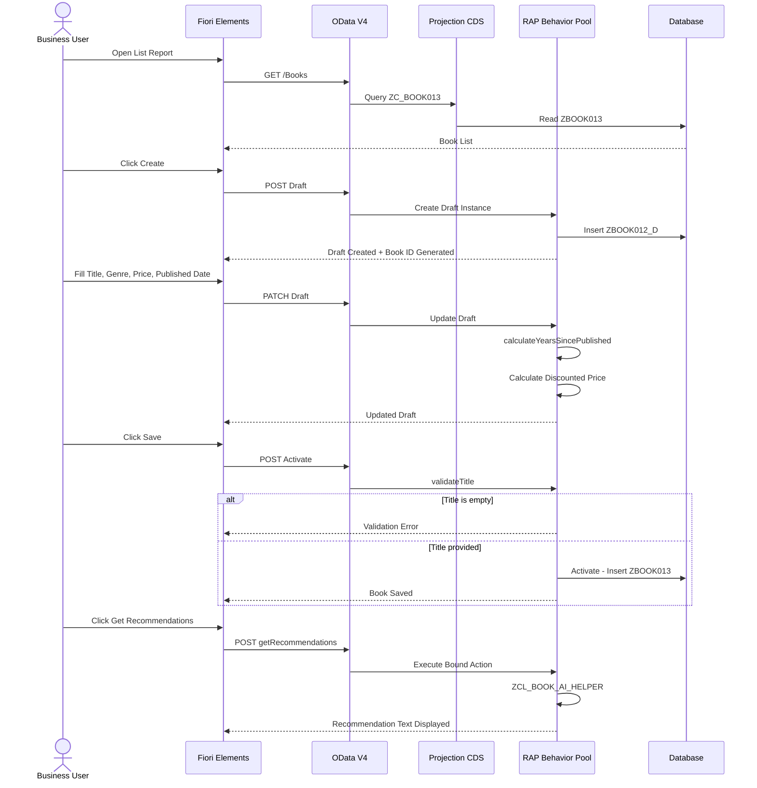

---

## 🧱 RAP Business Object Architecture

### Layered Design

The application follows the standard **RAP managed implementation** pattern with a clear separation of concerns:

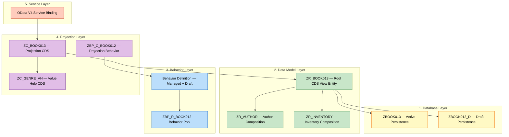

### RAP Concepts Applied

| Concept | Implementation | Purpose |
|---|---|---|
| **Managed RAP** | Framework handles CRUD persistence automatically | Reduces boilerplate; developer focuses on business logic |
| **Draft** | Draft table `ZBOOK012_D` stores in-progress edits | Users can save progress without committing; supports locking |
| **UUID Numbering** | Framework-managed UUID as internal key | Globally unique, conflict-free primary keys |
| **Book ID Generation** | Sequential `BOOK0001`, `BOOK0002` format | Human-readable business identifier |
| **Validation** | `validateTitle` on save | Enforces mandatory title rule before persistence |
| **Determination** | `calculateYearsSincePublished` on field change | Automatic derived field calculation |
| **Bound Action** | `getRecommendations` | Instance-level business operation |
| **Entity READ/MODIFY** | Local mode EML in behavior pool | Access/update BO data within the same LUW |
| **Persistence Mapping** | CDS-to-DB field mapping | Ensures calculated fields are correctly stored |
| **Compositions** | `ZR_AUTHOR`, `ZR_INVENTORY` | Models parent-child relationships within the BO |
| **Projection Behavior** | `ZBP_C_BOOK012` | Exposes only relevant operations to the service consumer |

---

## 📊 Data Model

### Book Entity — Primary Fields

| Field | Type | Description | Behavior |
|---|---|---|---|
| `UUID` | `sysuuid_x16` | Internal primary key | Hidden from UI |
| `BookID` | `char10` | Business identifier (`BOOK0001`) | Auto-generated, read-only |
| `Title` | `char256` | Book title | Mandatory (validated) |
| `Author` | `char256` | Author name | Editable |
| `Description` | `string` | Book description | Editable |
| `Genre` | `char50` | Book genre | Value help dropdown |
| `Currency` | `waers` | Currency key | Editable |
| `Price` | `curr` | Retail price | Editable |
| `DiscountedPrice` | `curr` | Calculated discounted price | Read-only, persisted |
| `PublishedDate` | `dats` | Publication date | Editable |
| `YearsSincePublished` | `int4` | Years since publication | Auto-calculated, read-only |
| `StockQuantity` | `quan` | Available stock | Editable |
| `QuantityUnit` | `msehi` | Unit of measure | Editable |
| `Rating` | `int1` | Numeric rating | Editable |
| `RatingCategory` | `char20` | Rating display label | Derived |
| `Status` | `char20` | Book status | Editable |
| `BookRecommendations` | `string` | Recommendation text | Populated by action |
| *Administrative* | — | Created by, changed by, timestamps | Framework-managed |

### Entity Relationships

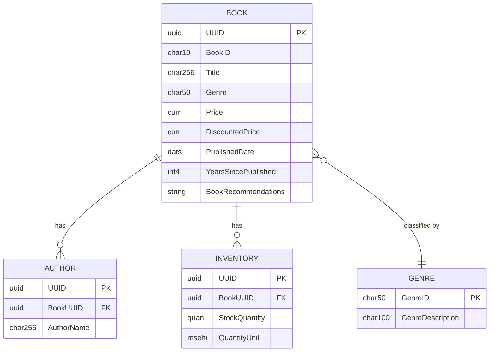

---

## ✅ Features Implemented

### 🔢 Automatic Book ID Generation

**Business Rule (BR-02):** Book IDs follow a sequential pattern — `BOOK0001`, `BOOK0002`, `BOOK0003` — and are automatically assigned by the backend. The user never enters the ID manually.

**Why this matters:**
- Eliminates duplicate ID conflicts
- Ensures consistent formatting
- Reduces user effort on every create operation

**Technical approach:**
The behavior pool queries the highest existing Book ID (across both active and draft tables), increments the counter, and assigns the next value during entity creation.

```
New Book Created
       ↓
 Query Max BookID
 (Active + Draft)
       ↓
 Increment Counter
       ↓
 Assign BOOK0004
       ↓
 Read-only on UI
```

---

### 🛡 RAP Validation — `validateTitle`

**Business Rule (BR-03):** The book title cannot be empty. This is enforced at the **RAP behavior layer** before save, not merely on the frontend.

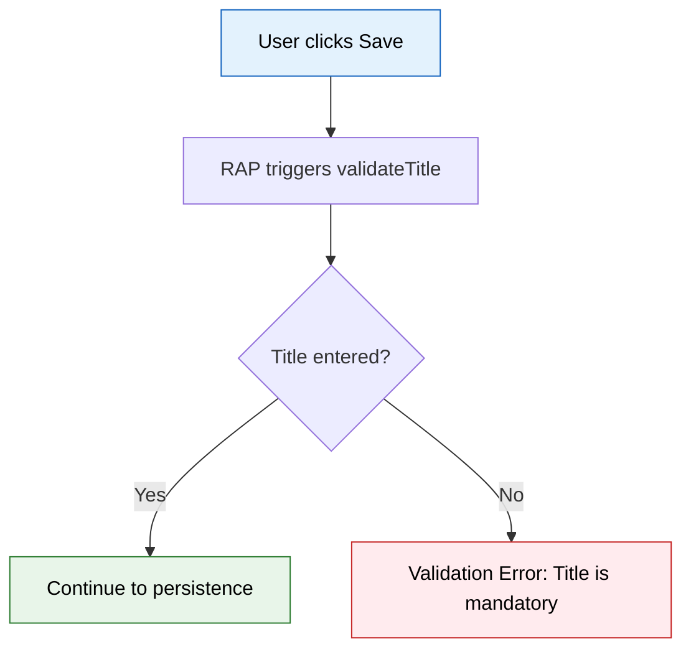

**Why backend validation matters:**

| Frontend-Only Validation | RAP Backend Validation |
|---|---|
| Can be bypassed via API/OData calls | Enforced regardless of entry channel |
| Inconsistent across clients | Single source of truth |
| Duplicated logic | Centralized business rule |
| Cannot access server-side data | Full access to BO state |

The validation uses `READ ENTITIES ... IN LOCAL MODE` to access the current entity state and raises `FAILED` / `REPORTED` messages if the title is empty.

---

### 📐 RAP Determination — `calculateYearsSincePublished`

**Business Rule (BR-04):** When the user enters or changes the `PublishedDate`, the system automatically calculates `YearsSincePublished`.


**Implementation detail:**
The determination is configured to trigger on changes to `PublishedDate` — **not** on changes to `YearsSincePublished` itself.

> **Key Design Lesson:**
>
> Configuring a determination to trigger on its own output field creates a **cyclical trigger loop** — the determination fires, updates the field, which triggers the determination again. This was identified and resolved during development by ensuring the trigger field (`PublishedDate`) is the **source input**, not the derived output.
>
> This is a common RAP design pitfall and an important pattern to understand for any RAP-based project.

---

### 💰 Discounted Price Calculation

**Business Rule (BR-05):** `DiscountedPrice = Price * 98 / 100` (a 2% discount)


| Aspect | Detail |
|---|---|
| **Input** | `Price` — editable by user |
| **Output** | `DiscountedPrice` — read-only, persisted to database |
| **Rule** | 2% discount applied automatically |
| **Persistence** | Field is mapped to `ZBOOK013` and stored in the database |

**Why `DiscountedPrice` is persisted (not virtual):**

The discounted price is mapped to the database table via CDS persistence mapping. This ensures consistency between the CDS view entity, the behavior definition, and the database schema. A mismatch between these layers (e.g., declaring a field as virtual in CDS but mapping it to a DB column) causes runtime errors — this was encountered and resolved during development.

---

### 🏷 Genre Value Help

**Business Rule (BR-06):** Genre must be selected from a controlled list, not entered as free text.

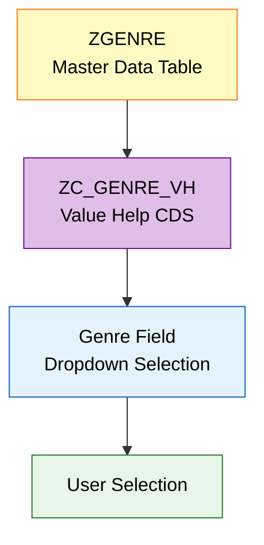

**Available genres:**

| Genre |
|---|
| Fiction |
| Science Fiction |
| Fantasy |
| Mystery |
| Thriller |
| Romance |
| Biography |
| History |
| Technology |
| Business |
| Education |

**UX benefit:** Controlled value help eliminates free-text inconsistencies (e.g., "Sci-Fi" vs "Science Fiction" vs "SF") and ensures clean, queryable data across the entire book catalog.

The value help is configured via CDS annotation to support dropdown-style selection behavior on the Fiori Elements UI.

---

### ⭐ Rating UX

**Business Rule (BR-07):** The rating field is presented in a business-friendly manner.

The rating is implemented as a numeric value with an associated `RatingCategory` for human-readable display. Metadata extensions control the visual presentation on the Fiori Elements UI, ensuring that ratings are immediately understandable without requiring users to interpret raw numbers.

---

### 🤖 Recommendation Action — `getRecommendations`

**Business Rule (BR-08):** Users can trigger a **Get Recommendations** action from the Object Page to receive book recommendations based on the current book's genre.

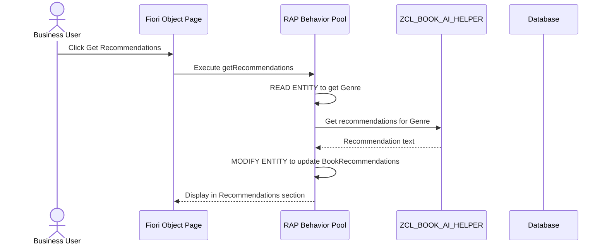

**Implementation approach:**

The `getRecommendations` action is a **bound RAP action** on the Book entity. When triggered:

1. The behavior pool reads the current book's genre using `READ ENTITIES ... IN LOCAL MODE`
2. Passes the genre to `ZCL_BOOK_AI_HELPER`
3. The helper class returns genre-appropriate recommendation text
4. The behavior pool updates the `BookRecommendations` field using `MODIFY ENTITIES ... IN LOCAL MODE`
5. The Fiori Object Page displays the result in a dedicated **AI Recommendations** section

> **Important clarification:**
>
> `ZCL_BOOK_AI_HELPER` is a **license-free deterministic recommendation helper**. It provides genre-based recommendations using internal logic — it does **not** call an external Generative AI service at runtime.
>
> Integration with a live AI service (e.g., SAP AI Core, Azure OpenAI) is a viable **future enhancement**.

---

## 🧠 AI-Assisted Development

### Development-Time AI is NOT Runtime AI

This project leverages AI **during development**, not as a runtime feature.

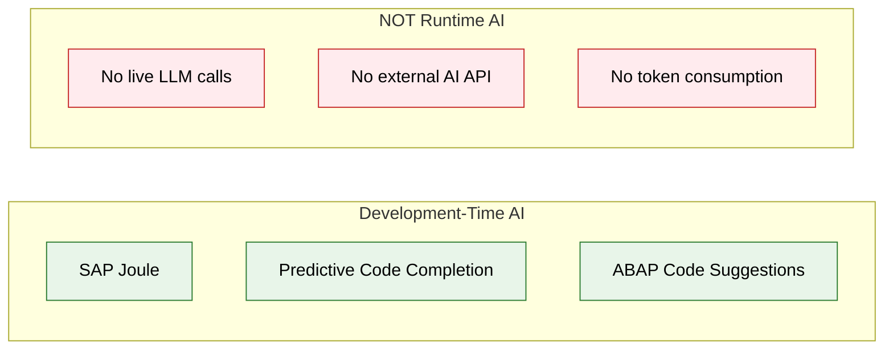

**Where AI-assisted development was used:**

| Area | AI Contribution |
|---|---|
| RAP implementation | Joule-assisted code generation and pattern completion |
| ABAP code completion | Predictive suggestions for behavior pool logic |
| Validation logic | AI-assisted boilerplate generation |
| Determination logic | Code suggestions for field calculations |
| Debugging / Refinement | AI-assisted analysis during troubleshooting |

**The runtime recommendation feature** (`ZCL_BOOK_AI_HELPER`) uses a deterministic, genre-based helper class — not a live AI service.

---

## 🖥 UI / UX Architecture

### Technology Stack

| Layer | Technology | Purpose |
|---|---|---|
| **UI Framework** | SAP Fiori Elements | Metadata-driven, annotation-based UI |
| **List Report** | Fiori Elements Floorplan | Search, filter, table view for all books |
| **Object Page** | Fiori Elements Floorplan | Detailed book view with grouped sections |
| **Annotations** | CDS Metadata Extensions | Control field visibility, labels, read-only behavior |
| **OData** | V4 | Modern protocol with draft and action support |

### UX Design Decisions

| Decision | Rationale |
|---|---|
| **UUID hidden** | Technical identifiers are irrelevant to business users; reduces cognitive noise |
| **Book ID read-only** | Auto-generated IDs prevent manual conflicts and ensure format consistency |
| **Automatic Book ID** | Reduces user effort — no need to look up the next available ID |
| **Genre dropdown** | Controlled value help improves data quality and prevents free-text inconsistencies |
| **Discounted Price read-only** | Business rule is enforced by backend — prevents manual overrides that break pricing logic |
| **Recommendations section** | Dedicated Object Page facet makes recommendation content easily discoverable |
| **Author section** | Groups author-related information in its own composition facet for clarity |
| **Inventory section** | Separates stock and quantity data from core book metadata for role-appropriate access |

### List Report — Visible Columns

| Column | Purpose |
|---|---|
| Book ID | Business identifier |
| Title | Primary descriptor |
| Author | Authorship |
| Genre | Classification |
| Price | Retail price |
| Discounted Price | Calculated business price |
| Rating | Quality indicator |
| Status | Current state |

> **Note:** `UUID` is intentionally excluded from the List Report to maintain a clean business view.

---

## 🗂 UI Information Architecture

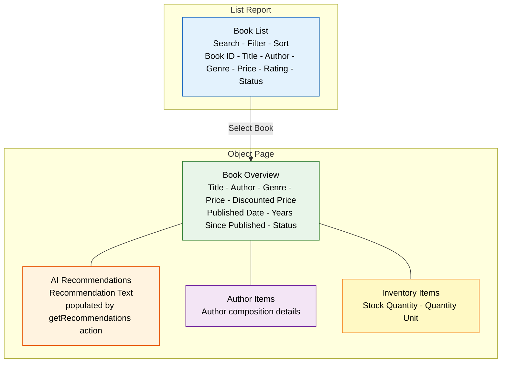

**Object Page Sections:**

```
Book
├── Book Overview          → Core book information
├── AI Recommendations     → Genre-based recommendation text
├── Author Items           → Author composition (child entity)
└── Inventory Items        → Inventory composition (child entity)
```

---

## 📝 Draft Architecture

**Business Rule (BR-09):** The application supports full draft-enabled transactional processing.

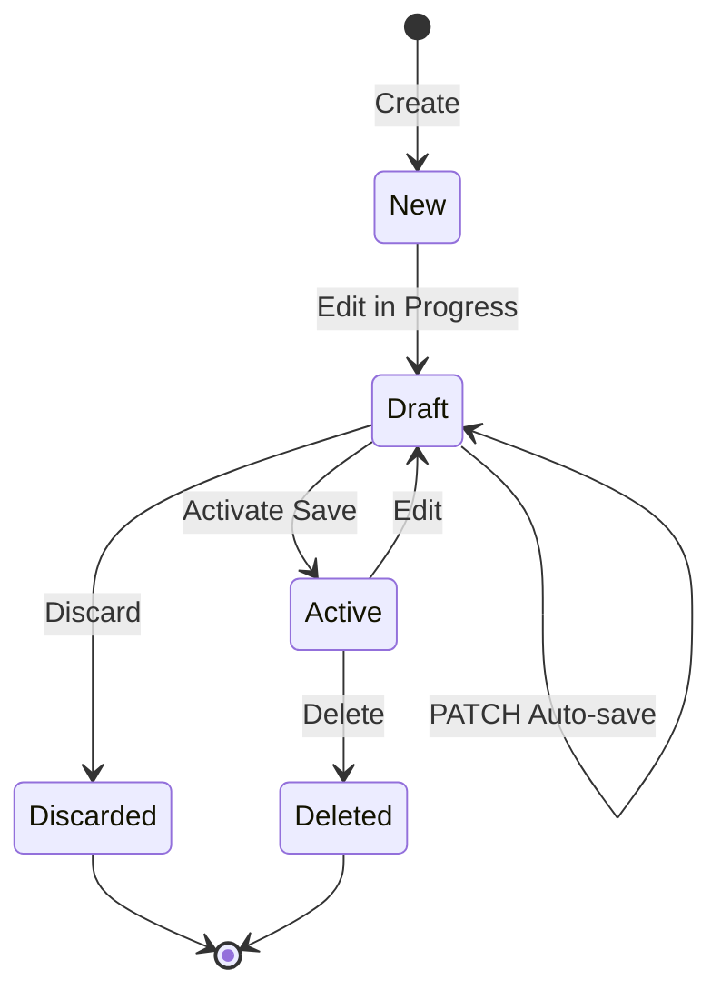

| Component | Purpose |
|---|---|
| `ZBOOK013` | Active persistence table — contains saved, committed data |
| `ZBOOK012_D` | Draft persistence table — contains in-progress, unsaved data |
| Managed RAP | Framework handles draft lifecycle (create, update, activate, discard) |

**Why draft processing matters:**
- Users can **start editing and return later** without losing work
- **Optimistic locking** prevents concurrent edit conflicts
- **Validation runs on activation**, not on every keystroke — better UX
- **Standard Fiori draft UX** — users see "Draft" indicator and can discard changes

---

## 🔒 Backend-Controlled Fields

Several fields are **intentionally read-only** on the UI because their values are controlled by backend business logic:

| Field | Control | Reason |
|---|---|---|
| `UUID` | Hidden | Technical key — no business relevance |
| `BookID` | Read-only | Auto-generated — manual entry would cause conflicts |
| `DiscountedPrice` | Read-only | Calculated from `Price` — manual override would violate business rule |
| `YearsSincePublished` | Read-only | Derived from `PublishedDate` — keeps data consistent |
| `BookRecommendations` | Read-only | Populated by `getRecommendations` action |

These constraints are enforced through **CDS metadata annotations** and **behavior definition field controls**, ensuring they apply regardless of the UI client or OData consumer.

---

## 🧪 Testing & Development Challenges

### Real Development Challenges & Lessons

These are actual challenges encountered during development — documented to demonstrate **problem-solving methodology**, not to catalog errors.

---

#### 1. CDS / Persistence Mapping Issue

| | Detail |
|---|---|
| **Problem** | Runtime error when reading/writing entity data |
| **Root Cause** | Mismatch between CDS view entity field definitions and database table column mappings — the persistence mapping in the CDS did not correctly align with the underlying table structure |
| **Solution** | Reviewed and corrected the `mapping` clause in the CDS view entity to ensure every persisted field maps to the correct database column |
| **Learning** | CDS, behavior definition, and database table must be kept **perfectly synchronized** — a mismatch at any layer causes hard-to-diagnose runtime failures |

---

#### 2. Persistent vs. Calculated Field Distinction

| | Detail |
|---|---|
| **Problem** | `DiscountedPrice` not behaving as expected — either not saving or causing mapping errors |
| **Root Cause** | Confusion between virtual (calculated-on-read) fields and persisted (stored) fields; the field was configured inconsistently across layers |
| **Solution** | Ensured `DiscountedPrice` is a **persisted** field with proper database column, CDS mapping, and behavior definition configuration |
| **Learning** | In RAP, a field that is **stored in the database** must be treated consistently as a persisted field across all layers — CDS, behavior definition, and metadata extension |

---

#### 3. Duplicate Draft Book ID Issue

| | Detail |
|---|---|
| **Problem** | Multiple draft instances could receive the same auto-generated Book ID |
| **Root Cause** | The ID generation logic only queried the active table, ignoring draft entries |
| **Solution** | Extended the Book ID generation to query **both** active and draft tables before assigning the next sequential ID |
| **Learning** | In a draft-enabled scenario, both persistence tables must be considered for any uniqueness logic |

---

#### 4. Determination Cyclical Trigger Issue

| | Detail |
|---|---|
| **Problem** | `calculateYearsSincePublished` determination triggered in an infinite loop |
| **Root Cause** | The determination was configured to trigger on changes to `YearsSincePublished` (its own output), causing a recursive cycle |
| **Solution** | Reconfigured the determination trigger to fire on `PublishedDate` changes (the input field) instead of the output field |
| **Learning** | RAP determinations must trigger on **source fields**, never on their own output — a fundamental RAP design principle |

---

#### 5. Genre Value Help / Dropdown Behavior

| | Detail |
|---|---|
| **Problem** | Genre field displayed as a plain input instead of a dropdown |
| **Root Cause** | Missing or incorrect CDS annotations for value help presentation |
| **Solution** | Configured the CDS value help annotation with the correct association and display properties to render as a dropdown |
| **Learning** | Fiori Elements UI behavior is entirely driven by **CDS annotations** — the correct annotation pattern must be applied for dropdown vs. dialog-style value help |

---

#### 6. UI Metadata / Read-Only Behavior

| | Detail |
|---|---|
| **Problem** | Calculated fields (`DiscountedPrice`, `YearsSincePublished`) were editable on the UI |
| **Root Cause** | Metadata extension annotations for read-only were missing or incorrectly placed |
| **Solution** | Applied proper `@UI.fieldGroup` and read-only annotations in the metadata extension |
| **Learning** | Field editability in Fiori Elements is controlled by metadata — both **CDS annotations** and **behavior definition field controls** must align |

---

#### 7. BAS to Separate ABAP Environment Connectivity

| | Detail |
|---|---|
| **Problem** | SAP Business Application Studio could not connect to the ABAP environment |
| **Root Cause** | Service key configuration or destination setup between BAS and the ABAP system was incomplete |
| **Solution** | Verified and corrected the connectivity setup between BAS and the target ABAP environment |
| **Learning** | Cloud development requires careful **environment connectivity setup** — this is a foundational step before any development work begins |

---

## 🎓 Key Technical Learnings

### ABAP Cloud
- Developing within the **ABAP Cloud** model and its restricted language scope
- Understanding the **released API** concept and avoiding classic ABAP patterns
- Working within the Clean Core paradigm

### RAP
- Building a complete **managed RAP business object** with draft support
- Implementing **validations**, **determinations**, and **bound actions**
- Using `READ ENTITIES` / `MODIFY ENTITIES` in local mode for entity access within the behavior pool
- Understanding **RAP trigger design** — which fields should trigger which determinations

### CDS
- Designing **CDS view entities** with associations, compositions, and persistence mapping
- Creating **value help CDS views** for controlled field selection
- Understanding the relationship between CDS views and database tables

### Fiori Elements
- Building **List Report** and **Object Page** floorplans entirely through annotations
- Controlling field visibility, labels, and grouping via **metadata extensions**
- Configuring **draft indicators** and action buttons

### UI/UX
- Designing for **business users**, not developers — hiding technical fields, using read-only for derived data
- Structuring Object Page **facets** for logical information grouping
- Applying **SAP Fiori Design Guidelines** in practice

### Debugging
- Diagnosing **CDS/persistence mapping mismatches**
- Resolving **determination trigger cycles**
- Debugging **draft vs. active table** consistency issues
- Tracing **OData requests** to backend behavior

### Clean Core
- Keeping business logic in the **RAP layer**, not in UI or custom exits
- Using **standard Fiori Elements** patterns instead of custom UI extensions
- Avoiding non-released APIs

### AI-Assisted Development
- Using **SAP Joule** for code generation and suggestions
- Leveraging **predictive code completion** during ABAP development
- Understanding the boundary between AI-assisted development and AI-powered features

---

## 🛤 Development Journey

```mermaid
graph LR
    A["1. Environment Setup<br/>BAS + ABAP Cloud"] --> B["2. Data Model<br/>Tables + CDS"]
    B --> C["3. RAP Behavior<br/>Managed + Draft"]
    C --> D["4. Business Logic<br/>Validation + Determination"]
    D --> E["5. Actions<br/>getRecommendations"]
    E --> F["6. Value Help<br/>Genre Dropdown"]
    F --> G["7. Fiori UI<br/>List Report + Object Page"]
    G --> H["8. Refinement<br/>UX + Bug Fixes"]
    H --> I["9. Documentation<br/>README + Architecture"]

    style A fill:#E3F2FD,stroke:#1565C0,color:#000
    style B fill:#C8E6C9,stroke:#2E7D32,color:#000
    style C fill:#FFF9C4,stroke:#F57F17,color:#000
    style D fill:#FFCCBC,stroke:#BF360C,color:#000
    style E fill:#E1BEE7,stroke:#6A1B9A,color:#000
    style F fill:#B2EBF2,stroke:#00695C,color:#000
    style G fill:#F3E5F5,stroke:#6A1B9A,color:#000
    style H fill:#DCEDC8,stroke:#33691E,color:#000
    style I fill:#F5F5F5,stroke:#424242,color:#000
```

---

## 📸 Screenshots

> **Note:** Replace the placeholder paths below with actual screenshots from the running application.

| # | Screenshot | What to Notice |
|---|---|---|
| 1 | `docs/images/01-list-report.png` | Full List Report with Book ID, Title, Author, Genre, Price, Rating columns — clean business view with no technical fields |
| 2 | `docs/images/02-create-book.png` | Create dialog showing auto-generated Book ID and editable fields |
| 3 | `docs/images/03-validation-error.png` | Backend validation error when Title is left empty — message displayed inline on the Fiori UI |
| 4 | `docs/images/04-genre-dropdown.png` | Genre field with controlled dropdown / value help showing all 11 genre options |
| 5 | `docs/images/05-object-page.png` | Full Object Page with Book Overview, Recommendations, Author, and Inventory sections |
| 6 | `docs/images/06-discounted-price.png` | Price and Discounted Price side by side — Price editable, Discounted Price read-only and auto-calculated |
| 7 | `docs/images/07-recommendations.png` | AI Recommendations section populated after executing the Get Recommendations action |
| 8 | `docs/images/08-rating.png` | Rating field displayed in business-friendly format |

<!--
To add screenshots, place the image files in the docs/images/ directory and uncomment the lines below:


-->

---

## 📊 Feature Matrix

| Feature | Status | Details |
|---|---|---|
| Book CRUD Operations | ✅ Implemented | Create, Read, Update, Delete via Fiori Elements |
| Automatic Book ID Generation | ✅ Implemented | Sequential `BOOK0001` format, read-only |
| Title Validation | ✅ Implemented | RAP `validateTitle` — mandatory field check |
| Years Since Published | ✅ Implemented | RAP determination from `PublishedDate` |
| Discounted Price Calculation | ✅ Implemented | `Price * 98 / 100`, persisted, read-only |
| Genre Value Help | ✅ Implemented | CDS-driven dropdown from `ZGENRE` |
| Rating Display | ✅ Implemented | Business-friendly rating presentation |
| Get Recommendations Action | ✅ Implemented | Bound RAP action with `ZCL_BOOK_AI_HELPER` |
| Draft Processing | ✅ Implemented | Full draft lifecycle with `ZBOOK012_D` |
| Author Composition | ✅ Implemented | Child entity via `ZR_AUTHOR` |
| Inventory Composition | ✅ Implemented | Child entity via `ZR_INVENTORY` |
| Hidden UUID | ✅ Implemented | Metadata annotations hide technical key |
| OData V4 Service | ✅ Implemented | Standard OData V4 service binding |
| List Report | ✅ Implemented | Fiori Elements floorplan |
| Object Page | ✅ Implemented | Multi-section with facets |
| AI-Assisted Development | ✅ Used | SAP Joule during development |
| Live Generative AI Integration | 🔮 Future | Not implemented — current helper is deterministic |
| Authorization / Access Control | 🔮 Future | Not yet implemented |
| ABAP Unit Tests | 🔮 Future | Planned |
| CI/CD Pipeline | 🔮 Future | Planned |

---

## 💡 Business Value

### Before vs. After

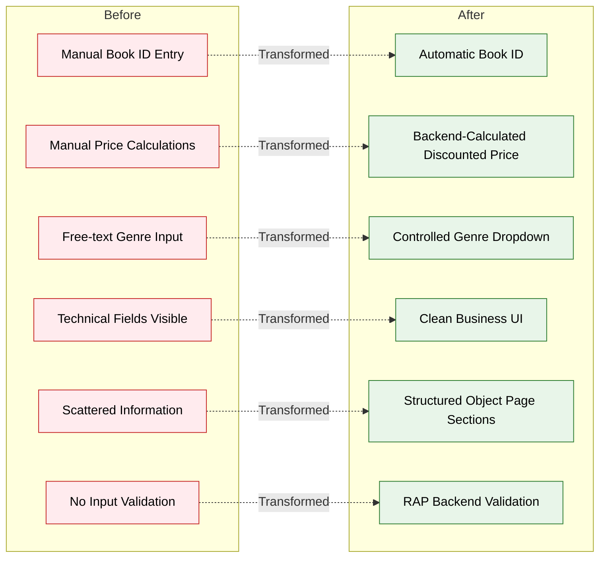

### Measurable Improvements

| Dimension | Impact |
|---|---|
| **Reduced manual entry** | Auto-generated Book IDs, auto-calculated fields eliminate repetitive data entry |
| **Improved data consistency** | Controlled genre selection prevents free-text variants |
| **Reduced user errors** | Backend validation catches mistakes before save |
| **Cleaner business UI** | Technical fields hidden; only business-relevant data shown |
| **Centralized business logic** | All rules in RAP layer — single source of truth |
| **Better maintainability** | Metadata-driven UI; changes via annotations, not code |
| **Draft support** | Users can work incrementally without losing progress |

---

## 🎯 Why This Project Matters to Recruiters

This is not a tutorial follow-along — it is a **complete, end-to-end SAP RAP application** demonstrating skills across the full technology stack.

### Backend Skills Demonstrated

| Skill | Evidence |
|---|---|
| **ABAP Cloud** | Entire project built on ABAP Cloud with released APIs |
| **RAP (Managed)** | Full managed BO with CRUD, draft, validation, determination, action |
| **CDS View Entities** | Root entity, compositions, value helps, associations |
| **Behavior Definitions** | Managed implementation with draft, field controls, action definitions |
| **Behavior Pools** | Custom logic for validation, determination, Book ID generation, actions |
| **Persistence Mapping** | CDS-to-database field mapping with consistency verification |
| **Draft Processing** | Active + draft table architecture with activation logic |

### Frontend Skills Demonstrated

| Skill | Evidence |
|---|---|
| **Fiori Elements** | List Report + Object Page — fully annotation-driven |
| **OData V4** | Service binding, entity exposure, action exposure |
| **Metadata Extensions** | Field visibility, labels, grouping, read-only controls |
| **Value Help** | CDS-driven dropdown for genre selection |
| **Business-Oriented UI** | UUID hidden, derived fields read-only, logical section grouping |

### Engineering Skills Demonstrated

| Skill | Evidence |
|---|---|
| **Debugging** | Resolved CDS mapping errors, cyclical triggers, draft ID conflicts |
| **Root-Cause Analysis** | Systematic problem then root cause then solution then learning approach |
| **Backend/Frontend Separation** | All business logic in RAP; UI driven by metadata |
| **RAP Trigger Design** | Correct determination trigger configuration (source vs. output) |
| **Persistent Calculations** | Discounted price stored consistently across CDS, behavior, and DB |
| **Clean Core Mindset** | No non-released APIs, standard Fiori Elements patterns |
| **AI-Assisted Development** | Productive use of SAP Joule during development |

---

## 🔮 Future Enhancements

| Enhancement | Description | Priority |
|---|---|---|
| **Live Generative AI Integration** | Replace `ZCL_BOOK_AI_HELPER` with a real AI service (SAP AI Core / Azure OpenAI) for dynamic recommendations | High |
| **Authorization & Access Control** | Implement RAP authorization master/instance checks for role-based access | High |
| **ABAP Unit Tests** | Add unit tests for validation, determination, and action logic | High |
| **RAP Integration Tests** | End-to-end test scenarios covering the full BO lifecycle | Medium |
| **CI/CD Pipeline** | Automated build, test, and deployment via SAP BTP CI/CD or gCTS | Medium |
| **Advanced Inventory Logic** | Stock level alerts, reorder point calculations | Medium |
| **Enhanced Rating Visualization** | Star rating, progress bar, or criticality-based color coding | Low |
| **Production Number Range** | Replace custom ID generation with SAP number range objects for concurrency safety | Medium |
| **Multi-Language Support** | Internationalization of UI labels and validation messages | Low |

---

## 📁 Repository Structure

> **Note:** The structure below represents a recommended GitHub organization. Actual ABAP Cloud objects reside in the SAP BTP ABAP Environment under package `ZAC_GE362159`.

```
sap-rap-book-management/
│
├── README.md                          # This file
├── LICENSE
│
├── docs/
│   ├── architecture.md                # Detailed architecture documentation
│   └── images/
│       ├── 01-list-report.png
│       ├── 02-create-book.png
│       ├── 03-validation-error.png
│       ├── 04-genre-dropdown.png
│       ├── 05-object-page.png
│       ├── 06-discounted-price.png
│       ├── 07-recommendations.png
│       └── 08-rating.png
│
└── src/
    ├── cds/
    │   ├── zr_book013.cds             # Root CDS View Entity
    │   ├── zc_book013.cds             # Projection CDS View
    │   ├── zr_author.cds              # Author Composition CDS
    │   ├── zr_inventory.cds           # Inventory Composition CDS
    │   └── zc_genre_vh.cds            # Genre Value Help CDS
    │
    ├── behavior/
    │   ├── zbp_r_book012.abap         # Root Behavior Pool
    │   └── zbp_c_book012.abap         # Projection Behavior
    │
    ├── tables/
    │   ├── zbook013.tabl              # Active Database Table
    │   ├── zbook012_d.tabl            # Draft Database Table
    │   └── zgenre.tabl                # Genre Master Data Table
    │
    ├── classes/
    │   └── zcl_book_ai_helper.abap    # Recommendation Helper Class
    │
    ├── metadata/
    │   └── zc_book013.metadata        # Metadata Extension
    │
    └── service/
        └── service_binding.srvb       # OData V4 Service Binding
```

---

## 👨‍💻 Developer

**SAP ABAP Cloud / RAP Developer**

- Built with ABAP Cloud on SAP BTP ABAP Environment
- Developed using SAP Business Application Studio (BAS)
- AI-assisted development with SAP Joule

---

## 📄 Portfolio Disclaimer

This project is a **personal portfolio application** developed for learning and skill demonstration purposes. It is not a production system and does not contain any customer data, proprietary business logic, or confidential information.

- All data is fictional and created for demonstration purposes
- No credentials, tokens, or secrets are included in this repository
- The application showcases SAP technology skills and is not affiliated with any employer or client
- `ZCL_BOOK_AI_HELPER` is a deterministic helper class — not a live AI service

---

<div align="center">

**Built with ABAP Cloud · RAP · CDS · OData V4 · Fiori Elements**

*Demonstrating enterprise SAP development skills through a complete, end-to-end application*

</div>
